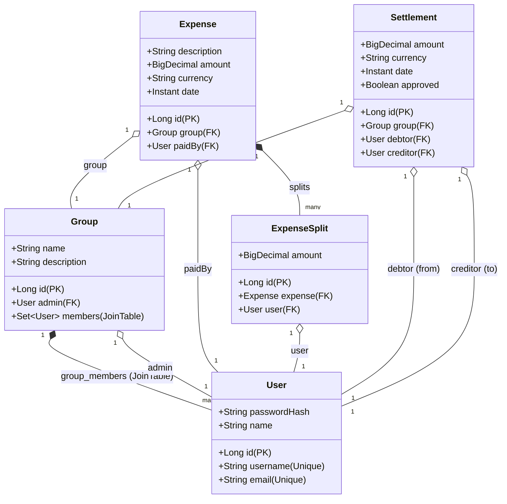

# 📖 Dokumentacja Techniczna & Przewodnik Onboardingowy Dewelopera

Niniejszy dokument stanowi pełną, kompleksową dokumentację techniczno-projektową aplikacji **Group Costs Split** (Podział Kosztów Grupowych). Jego celem jest umożliwienie nowemu deweloperowi błyskawicznego wdrożenia się w strukturę projektu, zrozumienia logiki działania każdego pliku, poznania kluczowych algorytmów oraz architektury integracji backend-frontend.

---

## 1. Architektura Systemowa i Przepływ Danych

Aplikacja opiera się na nowoczesnej architekturze klient-serwer w 100% opartej o ekosystem języka Kotlin:

```
[ Przeglądarka Użytkownika ]
       │
       ▼ (Compose Multiplatform UI - Canvas)
[ Kotlin/Wasm (Module: webApp) ]
       │
       ▼ (Komunikacja REST: Ktor HttpClient + JSON Serialization)
[ Spring Boot API (Module: backend) ]
       │
       ▼ (Spring Data JPA / Hibernate)
[ Baza danych PostgreSQL ]
```

### Przepływ autoryzacji (JWT Stateless):
1. Klient przesyła dane logowania (`LoginRequest`) do `/api/auth/login`.
2. Serwer weryfikuje dane, generuje bezstanowy token JWT (podpisany kluczem HMAC-SHA256) i zwraca go w `AuthResponse`.
3. Klient zapisuje token w pamięci podręcznej serwisu `ApiClient`.
4. Każde kolejne zapytanie z poziomu Ktor Clienta automatycznie wstrzykuje nagłówek `Authorization: Bearer <token>`.
5. Serwer weryfikuje token w filtrze `JwtAuthenticationFilter` przed dopuszczeniem żądania do kontrolera.

---

## 2. Model Danych (JPA Entities)

Baza danych PostgreSQL reprezentowana jest przez 5 głównych encji JPA powiązanych relacjami relacyjnymi:



---

## 3. Szczegółowy Opis Plików i Modułów (Walkthrough)

### 📂 Moduł 1: `backend/` (Spring Boot API)

Katalog źródłowy backendu znajduje się w `backend/src/main/kotlin/com/splitcosts/backend/`.

#### `BackendApplication.kt`
* **Lokalizacja:** `com/splitcosts/backend/`
* **Rola:** Główna klasa startowa Spring Boot. Adnotacja `@SpringBootApplication` uruchamia autokonfigurację Springa, skanowanie komponentów oraz wbudowany serwer Tomcat na porcie `8080`.

#### Podkatalog `model/` (Warstwa danych / Hibernate)
1. **`User.kt`**: Definiuje użytkownika aplikacji. Zawiera unikalny login i email oraz zahashowane hasło. Nadpisuje metody `equals` i `hashCode` przy użyciu ID w celu zachowania spójności w kolekcjach Hibernate.
2. **`Group.kt`**: Reprezentuje grupę rozliczeniową. Zawiera relację `@ManyToOne` do administratora grupy (User) oraz `@ManyToMany` z tabelą łączącą `group_members` przechowującą członków grupy.
3. **`Expense.kt`**: Reprezentuje zarejestrowany wydatek. Posiada precyzyjne pole `amount` (BigDecimal) w celu uniknięcia problemów z zaokrąglaniem walutowym oraz relację `@OneToMany` z kaskadowym usuwaniem (`orphanRemoval = true`) dla szczegółów podziału (`splits`).
4. **`ExpenseSplit.kt`**: Definiuje dług konkretnego użytkownika za dany wydatek. Posiada relację dwustronną do encji `Expense`.
5. **`Settlement.kt`**: Reprezentuje spłatę długu między dłużnikiem (`debtor`) a wierzycielem (`creditor`). Posiada flagę `approved`, która decyduje, czy spłata została zaakceptowana przez odbiorcę i wpływa na saldo.

#### Podkatalog `repository/` (Warstwa dostępu do bazy - Spring Data JPA)
1. **`UserRepository.kt`**: Posiada metody wyszukiwania użytkownika po loginie lub emailu oraz sprawdzenia ich duplikacji w bazie.
2. **`GroupRepository.kt`**: Posiada zoptymalizowane zapytanie `@Query` pobierające wszystkie grupy, do których należy dany użytkownik (jako admin lub członek), chroniąc przed problemem zapytania N+1 za pomocą `LEFT JOIN FETCH`.
3. **`ExpenseRepository.kt`**: Odpowiada za pobieranie wydatków danej grupy posortowanych od najnowszych. Wykorzystuje `JOIN FETCH` w celu natychmiastowego zaciągnięcia szczegółów podziałów (`splits`) i płatnika (`paidBy`) w jednym zapytaniu.
4. **`SettlementRepository.kt`**: Pobiera historię spłat dla danej grupy, optymalizując zaciąganie obiektów dłużnika i wierzyciela.

#### Podkatalog `security/` (Zabezpieczenia JWT i Spring Security)
1. **`UserPrincipal.kt`**: Adapter (opakowanie) encji `User` implementujący interfejs `UserDetails` Spring Security. Umożliwia weryfikację uprawnień zalogowanego użytkownika.
2. **`CustomUserDetailsService.kt`**: Implementuje `UserDetailsService`. Ładuje użytkownika z bazy po loginie lub emailu na potrzeby autentykacji Spring Security.
3. **`JwtService.kt`**: Serwis narzędziowy JWT. Generuje tokeny na podstawie `UserDetails` z określonym czasem wygasania (`jwt.expiration`), parsuje roszczenia (claims) oraz waliduje poprawność podpisu tokenu kluczem HMAC-SHA256.
4. **`JwtAuthenticationFilter.kt`**: Filtr przechwytujący każde żądanie HTTP. Odczytuje nagłówek `Authorization: Bearer <token>`, weryfikuje go za pomocą `JwtService`, pobiera użytkownika i wstrzykuje obiekt autoryzacji do kontekstu bezpieczeństwa (`SecurityContextHolder`).
5. **`SecurityConfig.kt`**: Centralna konfiguracja Spring Security. Wyłącza CSRF (stateless API), włącza CORS, ustawia politykę sesji na bezstanową (`SessionCreationPolicy.STATELESS`), konfiguruje uprawnienia dostępu do endpointów (otwarte `/register` i `/login`, reszta zablokowana dla niezalogowanych) oraz pozwala na poprawne działanie ramki H2 Console (`frameOptions.sameOrigin()`).

#### Podkatalog `dto/` (Warstwa transferu danych i mapowania)
1. **`AuthDtos.kt`**, **`GroupDtos.kt`**, **`ExpenseDtos.kt`**, **`BalanceDtos.kt`**, **`SettlementDtos.kt`**: Lekkie klasy danych (POJO/DTO) chroniące encje bazodanowe przed bezpośrednim wystawieniem w API.
2. **`Mappers.kt`**: Funkcje rozszerzające w Kotlinie (np. `User.toDto()`), które w elegancki sposób i bez używania ciężkich bibliotek typu MapStruct przepisują dane z encji JPA na DTO.

#### Podkatalog `service/` (Serwisy z logiką biznesową)
1. **`AuthService.kt`**: Odpowiada za rejestrację (weryfikacja zajętości loginu/emaila, szyfrowanie hasła za pomocą BCrypt) oraz logowanie (wywołanie `AuthenticationManager` i wygenerowanie tokenu JWT).
2. **`GroupService.kt`**: Zarządza cyklem życia grup. Kontroluje uprawnienia (sprawdza czy użytkownik wykonujący operację zaproszenia lub usunięcia jest administratorem danej grupy).
3. **`ExpenseService.kt`**: Rejestruje wydatki. **Zawiera algorytm automatycznego równego podziału** (gdy wejściowa lista splitów jest pusta). Dzieli kwotę po równo, a ewentualne różnice groszowe (wynikające z nieskończonego ułamka jak 100/3) przypisuje ostatniemu członkowi grupy. W przypadku podziałów niestandardowych weryfikuje, czy suma splitów zgadza się z całkowitą kwotą wydatku.
4. **`SettlementService.kt`**: Rejestruje spłaty oraz pozwala wierzycielowi na zatwierdzenie spłaty (`approveSettlement`), co powoduje aktywację spłaty w wyliczeniach bilansów.
5. **`BalanceService.kt`**: **Kluczowy serwis obliczeniowy.** Zbiera wszystkie wydatki oraz zatwierdzone spłaty w danej grupie, grupuje je według walut i wylicza bilans netto każdego użytkownika. Na podstawie tych bilansów **uruchamia algorytm upraszczania długów** (Simplify Debts) osobno dla każdej waluty.

#### Podkatalog `controller/` (Warstwa REST API)
1. **`AuthController.kt`**, **`GroupController.kt`**, **`ExpenseController.kt`**, **`BalanceController.kt`**: Kontrolery REST wystawiające ustrukturyzowane endpointy API. Pobierają zalogowanego użytkownika bezpośrednio z kontekstu bezpieczeństwa za pomocą adnotacji `@AuthenticationPrincipal`.
2. **`GlobalExceptionHandler.kt`**: Centralny system przechwytywania wyjątków. Mapuje wyjątki biznesowe (jak brak dostępu, brak elementu czy błędne dane) na spójne struktury JSON z kodami błędów HTTP (400, 403, 404, 500).

#### Podkatalog `config/` (Konfiguracja startowa)
* **`DatabaseInitializer.kt`**: Komponent implementujący `CommandLineRunner`. Wykonuje się automatycznie przy każdym starcie aplikacji. Jeśli wykryje, że baza danych jest pusta, automatycznie generuje zestaw zbalansowanych, przykładowych użytkowników, grup, wydatków i spłat, przygotowując system do natychmiastowych testów.

---

### 📂 Moduł 2: `frontend/` (Kotlin Multiplatform / Wasm)

Katalog źródłowy frontendu Compose znajduje się w `frontend/shared/src/commonMain/kotlin/org/example/frontend/`.

#### `App.kt`
* **Lokalizacja:** `shared/src/commonMain/kotlin/org/example/frontend/`
* **Rola:** Główny router nawigacji interfejsu graficznego. Reaguje na zmiany w stosie nawigacyjnym `AppState.backStack` i renderuje odpowiedni ekran w zależności od aktualnego stanu.

#### Podkatalog `api/` (Warstwa sieciowa Ktor)
* **`ApiClient.kt`**: Implementacja asynchronicznego klienta sieciowego HTTP (Ktor 3.x) z wbudowanym silnikiem serializacji JSON. Przechowuje token JWT zalogowanego użytkownika w pamięci i automatycznie dołącza nagłówek `Authorization: Bearer <token>` do zapytań wymagających autoryzacji.

#### Podkatalog `model/` (Współdzielone DTO)
* **`Models.kt`**: Zestaw klas danych oznaczonych adnotacją `@Serializable`. Są one w 100% zgodne ze schematami JSON backendu, umożliwiając bezproblemową automatyczną serializację/deserializację przesyłanych danych. Kwoty walutowe reprezentowane są przez typ `Double` na potrzeby sprawnego renderowania UI w przeglądarce.

#### Podkatalog `ui/` (Design System i Ekrany)
1. **`AppState.kt`**: Globalny obiekt stanu (StateHolder). Zarządza stosem nawigacyjnym (backstack), sesją aktywnego użytkownika, globalnymi komunikatami błędów/sukcesu oraz stanem ładowania (`isLoading`), udostępniając reaktywne zmienne Compose (`mutableStateOf`).
2. **`Theme.kt`**: **Design System aplikacji.** Definiuje unikalny ciemny motyw oparty o gradient *Deep Space*, szklane przezroczyste karty (`GlassCard`) z jasnymi poświatami krawędzi, neonowe przyciski z cieniem jarzenia (`GlowButton`) oraz ustandaryzowane pola tekstowe (`PremiumTextField`). Zawiera również globalny układ ekranu (`BaseScreenLayout`) ze zintegrowanym loaderem i paskiem komunikatów.
3. **Podkatalog `ui/screens/` (Ekrany UI):**
   * **`LoginScreen.kt`** & **`RegisterScreen.kt`**: Ekrany logowania i rejestracji z wbudowaną walidacją pól wejściowych po stronie klienta oraz obsługą błędów.
   * **`GroupListScreen.kt`**: Panel główny użytkownika. Wyświetla listę aktywnych grup z podziałem na role oraz udostępnia panel szybkiego tworzenia nowej grupy z lewej strony.
   * **`GroupDetailsScreen.kt`**: Szczegóły danej grupy. Z lewej strony pozwala adminowi na zarządzanie członkami (dodawanie/usuwanie), z prawej strony pokazuje kompletną historię wydatków wraz ze szczegółowym podziałem kosztów. Pozwala również na usuwanie wydatków.
   * **`AddExpenseScreen.kt`**: Formularz dodawania kosztu. Pozwala na wybór płatnika, kwoty i waluty. Obsługuje przełącznik trybu podziału: przy "Równym podziale" wysyła pustą listę splitów (backend dzieli kwotę), a przy "Niestandardowym podziale" otwiera listę członków z polami do ręcznego wpisania kwot, weryfikując poprawność sumy w czasie rzeczywistym.
   * **`BalancesScreen.kt`**: Ekran rozliczeń. Wizualizuje salda członków za pomocą kolorowych pasków bilansu. Wyświetla sugerowane uproszczone długi do spłaty z przyciskiem szybkiego uzupełnienia formularza spłaty. Pokazuje historię spłat z opcją potwierdzenia (akceptacji) odbioru przez wierzyciela.

---

## 4. Kluczowe Algorytmy (Opis Techniczny)

### A. Algorytm Upraszczania Długów (Simplify Debts)

Logika ta znajduje się w pliku `BalanceService.kt` w metodzie `simplifyDebtsForCurrency`. 

#### Założenie biznesowe:
Zamiast dokonywać wielu drobnych transakcji między wszystkimi uczestnikami, algorytm redukuje długi w obrębie tej samej waluty do minimalnej liczby przelewów.

#### Krok po kroku:
1. Obliczany jest bilans netto każdego użytkownika w grupie:
   $$\text{Saldo Netto}(U) = \sum \text{Zapłacone Koszty}(U) - \sum \text{Otrzymane Splity}(U) + \sum \text{Spłaty jako Debtor}(U) - \sum \text{Spłaty jako Creditor}(U)$$
2. Użytkownicy o saldzie ujemnym (dłużnicy) trafiają do listy `debtors`, a o saldzie dodatnim (wierzyciele) do listy `creditors`. Użytkownicy o saldzie bliskim zera (mniej niż 0.01) są ignorowani.
3. Sortujemy obie listy:
   * `debtors` rosnąco (największy dłużnik na początku).
   * `creditors` malejąco (największy wierzyciel na początku).
4. Parujemy pierwszego dłużnika z pierwszym wierzycielem. Kwota transakcji wynosi:
   $$\text{Kwota Spłaty} = \min(|\text{Saldo Dłużnika}|, \text{Saldo Wierzyciela})$$
5. Tworzymy uproszczony dług (`DebtDto`) od dłużnika do wierzyciela na wyliczoną kwotę.
6. Aktualizujemy salda w pamięci:
   * Saldo dłużnika zostaje zwiększone o kwotę spłaty.
   * Saldo wierzyciela zostaje pomniejszone o kwotę spłaty.
7. Jeśli saldo dłużnika osiągnęło 0, przesuwamy wskaźnik na kolejnego dłużnika. Jeśli saldo wierzyciela osiągnęło 0, przesuwamy wskaźnik na kolejnego wierzyciela.
8. Powtarzamy kroki 4-7, aż obie listy zostaną w pełni wyzerowane.

#### Kod algorytmu (Kotlin):
```kotlin
private fun simplifyDebtsForCurrency(balances: Map<User, BigDecimal>, currency: String): List<DebtDto> {
    val debtors = mutableListOf<Pair<User, BigDecimal>>()
    val creditors = mutableListOf<Pair<User, BigDecimal>>()
    val threshold = BigDecimal("0.01")

    balances.forEach { (user, bal) ->
        if (bal.compareTo(BigDecimal.ZERO) < 0 && bal.abs().compareTo(threshold) > 0) {
            debtors.add(Pair(user, bal))
        } else if (bal.compareTo(BigDecimal.ZERO) > 0 && bal.compareTo(threshold) > 0) {
            creditors.add(Pair(user, bal))
        }
    }

    debtors.sortBy { it.second } 
    creditors.sortByDescending { it.second } 

    val debts = mutableListOf<DebtDto>()
    var dIndex = 0
    var cIndex = 0

    val workingDebtors = debtors.map { it.second.abs() }.toMutableList()
    val workingCreditors = creditors.map { it.second }.toMutableList()

    while (dIndex < debtors.size && cIndex < creditors.size) {
        val debtorUser = debtors[dIndex].first
        val creditorUser = creditors[cIndex].first
        val debtorOwes = workingDebtors[dIndex]
        val creditorIsOwed = workingCreditors[cIndex]

        val transactionAmount = debtorOwes.min(creditorIsOwed)

        if (transactionAmount.compareTo(threshold) > 0) {
            debts.add(
                DebtDto(
                    fromUser = debtorUser.toDto(),
                    toUser = creditorUser.toDto(),
                    amount = transactionAmount.setScale(2, RoundingMode.HALF_UP).toDouble(),
                    currency = currency
                )
            )
        }

        workingDebtors[dIndex] = debtorOwes.subtract(transactionAmount)
        workingCreditors[cIndex] = creditorIsOwed.subtract(transactionAmount)

        if (workingDebtors[dIndex].compareTo(threshold) < 0) dIndex++
        if (workingCreditors[cIndex].compareTo(threshold) < 0) cIndex++
    }
    return debts
}
```

---

### B. Korekta Groszowa (Equal Split Adjustment)

Logika ta znajduje się w pliku `ExpenseService.kt` w metodzie `createExpense`.

#### Problem:
Przy podziale kwoty (np. 100.00 PLN) na 3 osoby, standardowy podział daje $100 / 3 = 33.3333...$ PLN. Zapisanie każdemu $33.33$ PLN da sumę $99.99$ PLN – brakuje 1 grosza. Zapisanie $33.34$ PLN da sumę $100.02$ PLN – za dużo o 2 grosze.

#### Rozwiązanie (Algorytm korekty):
1. Wyliczamy standardową kwotę bazową zaokrągloną do 2 miejsc po przecinku:
   $$\text{Kwota Bazowa} = \text{Zaokrąglij}(\text{Kwota} / N)$$
2. Dla pierwszych $N - 1$ członków grupy przypisujemy dokładnie kwotę bazową i sumujemy te przypisania.
3. Dla ostatniego ($N$-tego) członka grupy przypisujemy kwotę jako:
   $$\text{Kwota Ostatniego} = \text{Kwota Całkowita} - \text{Suma Przypisana Do } (N-1) \text{ Członków}$$
4. Dzięki temu suma podziałów zawsze równa się wejściowej kwocie co do jednego grosza, eliminując błędy niespójności sumy w bazie danych.

---

## 5. Kompletna Specyfikacja REST API

Wszystkie zapytania (poza Rejestracją i Logowaniem) wymagają nagłówka `Authorization: Bearer <JWT>`.

| Metoda | URL | Uprawnienia | Request Body (JSON) | Opis |
| :--- | :--- | :--- | :--- | :--- |
| **`POST`** | `/api/auth/register` | Otwarte | `RegisterRequest` | Rejestracja nowego użytkownika. Automatycznie loguje i zwraca token. |
| **`POST`** | `/api/auth/login` | Otwarte | `LoginRequest` | Logowanie użytkownika. Zwraca token JWT w przypadku sukcesu. |
| **`GET`** | `/api/auth/me` | Zalogowany | Brak | Pobranie profilu obecnie zalogowanego użytkownika (na podstawie tokenu). |
| **`GET`** | `/api/groups` | Zalogowany | Brak | Pobranie listy grup, do których należy użytkownik. |
| **`POST`** | `/api/groups` | Zalogowany | `CreateGroupRequest` | Tworzy nową grupę. Twórca staje się jej administratorem. |
| **`GET`** | `/api/groups/{id}` | Członek grupy | Brak | Pobranie szczegółowych danych grupy (członkowie, admin). |
| **`POST`** | `/api/groups/{id}/members` | Tylko Admin | `AddMemberRequest` | Dodanie nowego członka do grupy po loginie lub emailu. |
| **`DELETE`** | `/api/groups/{id}/members/{uId}`| Tylko Admin | Brak | Usunięcie członka z grupy (admin nie może usunąć samego siebie). |
| **`DELETE`** | `/api/groups/{id}` | Tylko Admin | Brak | Całkowite usunięcie grupy wraz ze wszystkimi wydatkami. |
| **`GET`** | `/api/groups/{id}/expenses` | Członek grupy | Brak | Pobranie historii wydatków w grupie. |
| **`POST`** | `/api/groups/{id}/expenses` | Członek grupy | `CreateExpenseRequest`| Dodanie wydatku w grupie (równy lub ręczny podział kwoty). |
| **`DELETE`**| `/api/groups/{id}/expenses/{eId}`| Admin / Płatnik | Brak | Usunięcie wydatku z grupy. |
| **`GET`** | `/api/groups/{id}/balances` | Członek grupy | Brak | Pobranie bilansów członków oraz uproszczonych sugerowanych spłat długów. |
| **`GET`** | `/api/groups/{id}/settlements`| Członek grupy | Brak | Pobranie historii spłat (rozliczeń) w grupie. |
| **`POST`** | `/api/groups/{id}/settlements`| Członek grupy | `CreateSettlementRequest`| Zarejestrowanie spłaty długu (oczekuje na akceptację wierzyciela). |
| **`POST`** | `/api/groups/{id}/settlements/{sId}/approve`| Tylko Wierzyciel| Brak | Zatwierdzenie otrzymania spłaty przez wierzyciela. |

---

## 6. Przewodnik Onboardingowy dla Nowego Dewelopera

Witaj w zespole! Ten krótki przewodnik pozwoli Ci skonfigurować środowisko i uruchomić projekt w kilka minut.

### Wymagania wstępne:
1. Zainstalowane środowisko **Java JDK 21** lub nowsze (zalecane LTS, np. Eclipse Temurin).
2. Zainstalowany i uruchomiony **Docker Desktop** (do konteneryzacji i bazy Postgres).
3. Środowisko IDE: **IntelliJ IDEA** (wersja Community lub Ultimate) z zainstalowaną wtyczką Kotlin.

### Krok 1: Klonowanie i struktura katalogów
Upewnij się, że struktura projektu po sklonowaniu jest nienaruszona. Katalog główny powinien zawierać foldery `backend` oraz `frontend`.

### Krok 2: Uruchomienie bazy danych (PostgreSQL)
Uruchom kontener z bazą danych za pomocą Dockera (w katalogu głównym projektu):
```bash
docker compose up db -d
```
Możesz zweryfikować stan kontenera wpisując `docker ps`. Baza PostgreSQL powinna działać na porcie `5432`.

### Krok 3: Import projektu do IntelliJ IDEA
1. Otwórz IntelliJ IDEA.
2. Wybierz **Open** i wskaż katalog główny projektu (`costs-split-compose`).
3. IntelliJ automatycznie wykryje dwa projekty Gradle (jeden w podfolderze `backend`, drugi w `frontend`) i rozpocznie synchronizację zależności (może to zająć około 1-3 minut przy pierwszym imporcie).

### Krok 4: Uruchomienie backendu w trybie deweloperskim
1. W IntelliJ otwórz plik `backend/src/main/kotlin/com/splitcosts/backend/BackendApplication.kt`.
2. Kliknij zieloną ikonę uruchamiania (*Run*) przy funkcji `main`.
3. *Alternatywnie z terminala w folderze `backend`:*
   ```bash
   ./gradlew bootRun
   ```
4. Spring Boot wystartuje na porcie `8080`. W logach powinieneś zobaczyć informację o pomyślnym połączeniu z bazą Postgres oraz załadowaniu przykładowych danych (Janek, Adam, Kasia).

### Krok 5: Uruchomienie frontendu (Compose Wasm)
1. Otwórz terminal w folderze `frontend` i wpisz:
   ```bash
   ./gradlew :webApp:wasmJsBrowserDevelopmentRun
   ```
2. Po kompilacji serwer deweloperski uruchomi się na porcie `8081` (lub losowym wolnym porcie wskazanym w logach).
3. Otwórz przeglądarkę i przejdź pod adres [http://localhost:8081](http://localhost:8081).
4. Zaloguj się wybranymi danymi testowymi (wszystkie posiadają hasło: **`password123`**).

### Krok 5.1: Wykaz kont testowych i weryfikacja poprawności systemu

Baza danych PostgreSQL po starcie zawiera predefiniowane scenariusze finansowe, które umożliwiają natychmiastowe przetestowanie kluczowych modułów aplikacji. Zaleca się następujący tok testów:

1. **Konto testowe: `janek` (Właściciel/Administrator, wierzyciel)**
   * **Rola:** Administrator grupy *Wyjazd na Mazury*. Posiada saldo dodatnie `+30.00 PLN` (miał `+50.00 PLN`, ale otrzymał i zatwierdził spłatę od Adama na kwotę `20.00 PLN`).
   * **Weryfikacja systemu:** Zaloguj się jako `janek`, aby przetestować:
     * **Panel Administracyjny:** Opcja zapraszania i wyrzucania członków grupy oraz usuwanie całej grupy.
     * **Zatwierdzanie spłat (dwufazowe rozliczenia):** W zakładce *Bilanse i Spłaty* Janek widzi historię spłat. Tylko on, jako wierzyciel, ma przycisk *Potwierdź* przy transakcjach oczekujących na zatwierdzenie.

2. **Konto testowe: `adam` (Płatnik pośredni, admin "Mieszkania")**
   * **Rola:** Płatnik w grupie *Mazury* (saldo końcowe `+10.00 PLN` po spłacie 20 PLN dla Janka). Administrator i jedyny płatnik w grupie *Wspólne Mieszkanie* (saldo `+40.00 PLN` - Janek jest mu winien 40 PLN).
   * **Weryfikacja systemu:** Zaloguj się jako `adam`, aby zweryfikować poprawne wyliczanie sald wielowalutowych i sald w wielu niezależnych grupach.

3. **Konto testowe: `kasia` (Dłużnik główny)**
   * **Rola:** Główny dłużnik grupy *Mazury* o saldzie netto `-40.00 PLN` (nie zarejestrowała żadnych własnych spłat).
   * **Weryfikacja systemu:** Zaloguj się jako `kasia`, aby przetestować:
     * **Wizualizację zadłużenia:** Czerwony, ujemny pasek bilansu netto w widoku rozliczeń.
     * **Kreator szybkich spłat:** Kliknij przycisk *Rozlicz* przy sugerowanym długu wobec Janka (`30.00 PLN`). Formularz automatycznie uzupełni dane. Po kliknięciu *Wyślij spłatę*, transakcja pojawi się w historii ze statusem *Oczekuje*. Dług zostanie zdjęty z sald dopiero, gdy Janek zatwierdzi transakcję ze swojego konta.

### Krok 6: Narzędzia diagnostyczne
* **Podgląd bazy danych (pgAdmin lub DBeaver):** Możesz połączyć się z lokalną bazą danych za pomocą dowolnego klienta SQL. Dane połączenia: `Host: localhost`, `Port: 5432`, `Database: splitcosts`, `Username: postgres`, `Password: strongpassword123`.
* **Rozwiązywanie problemów z zajętym portem 8080:** Jeśli Spring nie chce wystartować z powodu zajętego portu 8080, upewnij się, że zamknąłeś poprzednie procesy deweloperskie za pomocą komendy w PowerShell:
  ```powershell
  Stop-Process -Id (Get-NetTCPConnection -LocalPort 8080).OwningProcess -Force
  ```
